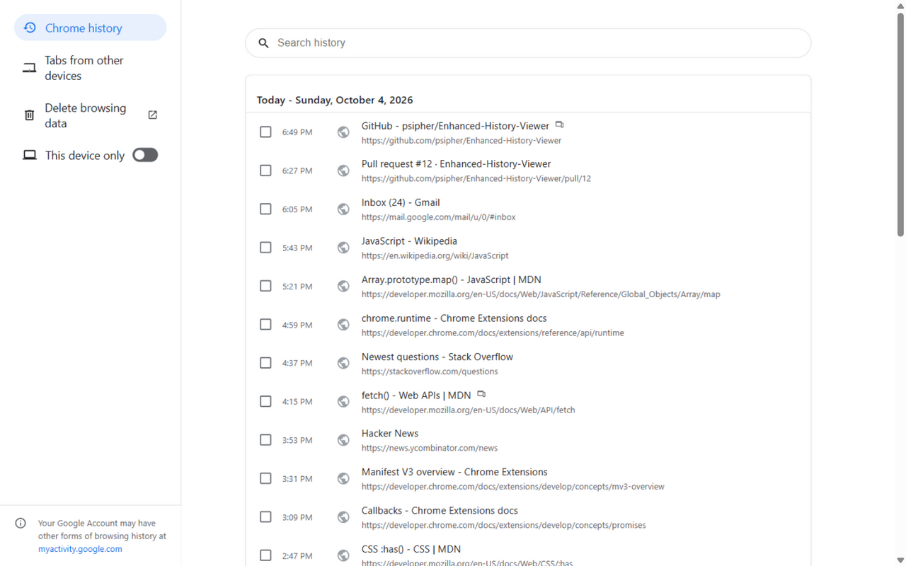
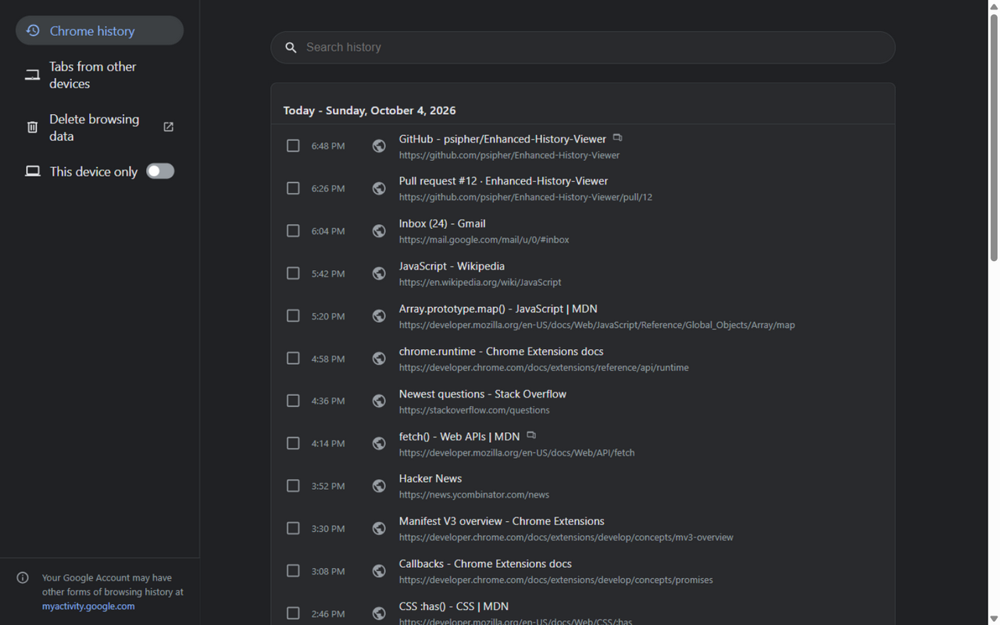
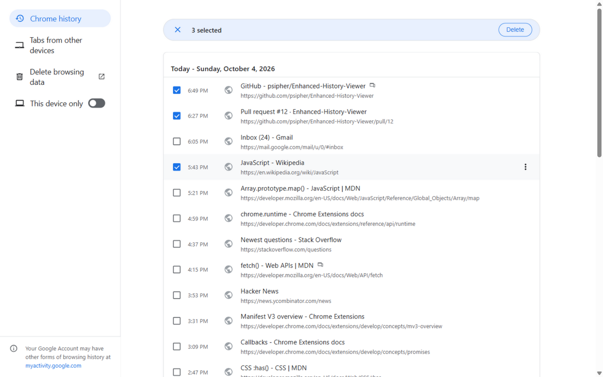
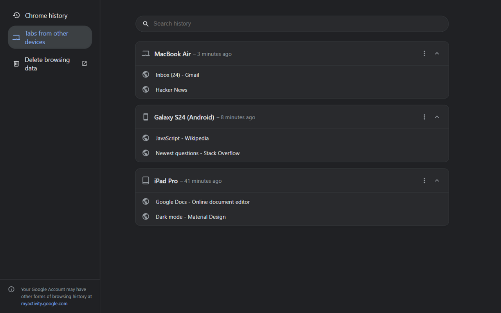
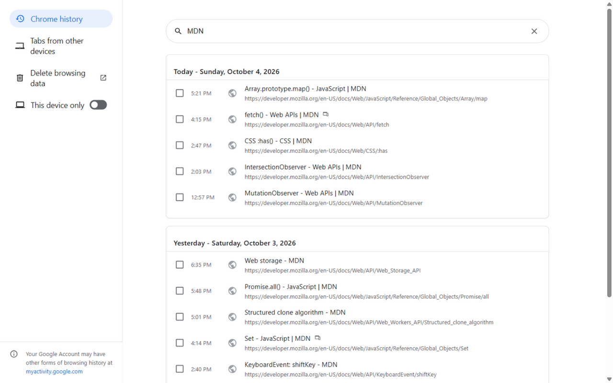
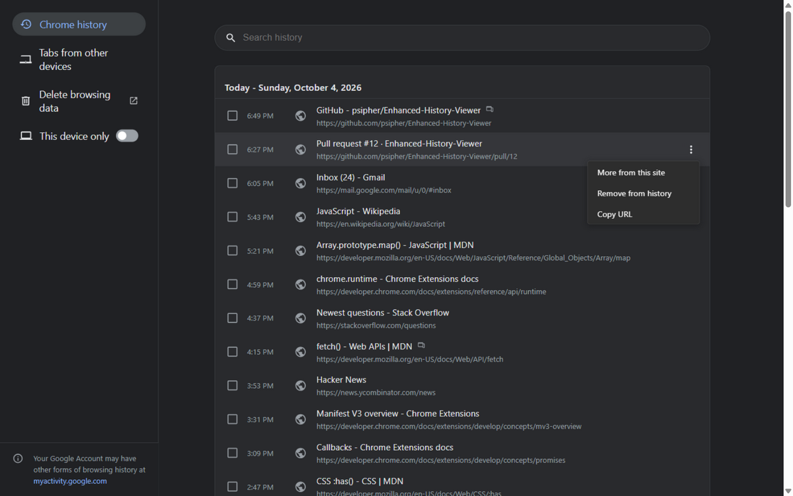
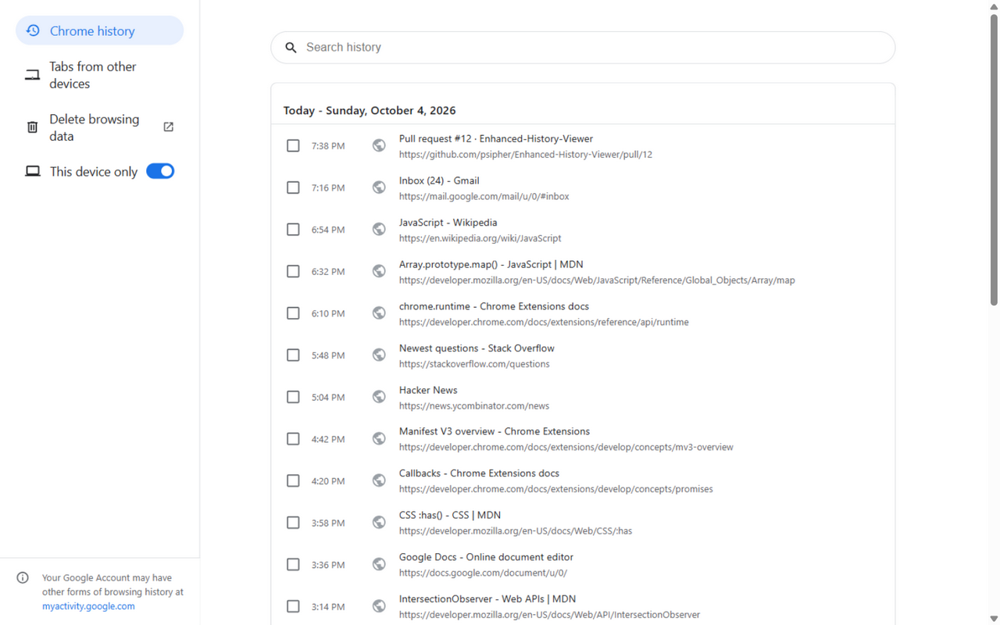

# Enhanced History Viewer

[Enhanced History Viewer](https://chromewebstore.google.com/detail/enhanced-history-viewer/pcojfenpnmoghjejjdkmbngpcmflmdfm?hl=en-US)
is a Chrome extension that replaces the default history page with a more intuitive and feature-rich interface. It provides a clean, modern design for browsing your Chrome history with full URL display and improved search functionality.

## Screenshots

| Light mode                                                               | Dark mode                                                              |
| ------------------------------------------------------------------------ | ---------------------------------------------------------------------- |
|  |  |

| Bulk selection                                                                  | Tabs from other devices                                               |
| ------------------------------------------------------------------------------- | --------------------------------------------------------------------- |
|  |  |

| Instant search                                                              | Item menu                                                   |
| --------------------------------------------------------------------------- | ----------------------------------------------------------- |
|  |  |

**"This device only" filter** — one toggle shows only the history recorded on this machine:



## Features

- **Modern Interface**: Clean, responsive design with support for both light and dark modes.
- **Full URL Display**: See the complete URL for each history item at a glance.
- **Fast Search**: Quickly find specific history items with responsive, as-you-type search.
- **Date Grouping**: History is grouped under readable, locale-aware "Today" / "Yesterday" headers.
- **Infinite Scrolling**: Easily browse through your entire history without pagination.
- **Chrome Integration**: Seamlessly replaces Chrome's built-in history page.
- **Bulk Operations**: Select multiple history items at once and delete them in parallel with a single click.
- **Tabs from other devices**: View and open tabs currently active on your synced phones, tablets, and computers from a dedicated sidebar tab — with collapsible device groups, relative last-active times, per-device "Open all" / "Hide for now" menus, and live search across synced tabs.
- **Smart Device Icons**: Displays a clean, native-feeling indicator icon next to synced history items.
- **This Device Only**: A sidebar toggle that filters your history down to visits recorded on this machine.

## Privacy

- **Zero external requests**: no trackers, no analytics, no remote calls — everything runs locally in your browser.
- Favicons are resolved locally through Chrome's built-in favicon API; a local placeholder is used when an icon is unavailable.
- The extension stores a single preference locally (`This device only` on/off) and collects nothing.
- The code is fully open-source — audit it right here in this repository.

## Installation

### From Chrome Web Store (Recommended)

1. Visit the [Enhanced History Viewer Chrome Web Store page](https://chromewebstore.google.com/detail/enhanced-history-viewer/pcojfenpnmoghjejjdkmbngpcmflmdfm?hl=en-US).
2. Click **"Add to Chrome"**.
3. Confirm by selecting **"Add Extension"**.
4. The extension will be installed, and you can access it by directly visiting history page.

### Manual Installation (Developer Mode)

If you prefer to install the extension manually:

1. **Download the Extension:**
   - Clone the repository:
     ```sh
     git clone https://github.com/psipher/Enhanced-History-Viewer.git
     ```
   - Or [download the ZIP file](https://github.com/psipher/Enhanced-History-Viewer/archive/refs/heads/main.zip) and extract it.

2. **Load the Extension in Chrome:**
   - Open Chrome and go to `chrome://extensions/`.
   - Enable **Developer Mode** (toggle in the top right).
   - Click **Load unpacked**.
   - Select the extracted folder.

3. **Start Using the Extension:**
   - The extension is now installed and ready to use.

## Usage

After installation, the extension will automatically replace Chrome's default history page. To activate the extension after installing, please close any existing History tabs or restart chrome. Then, simply press Ctrl+H (or Cmd+Y on Mac) to use the new viewer.

## Contributing

Contributions are welcome! Please feel free to submit a Pull Request.

## License

This project is licensed under the MIT License - see the [LICENSE](LICENSE) file for details.

## Acknowledgments

- Icons provided by [Google Material Design Icons](https://material.io/resources/icons/).
